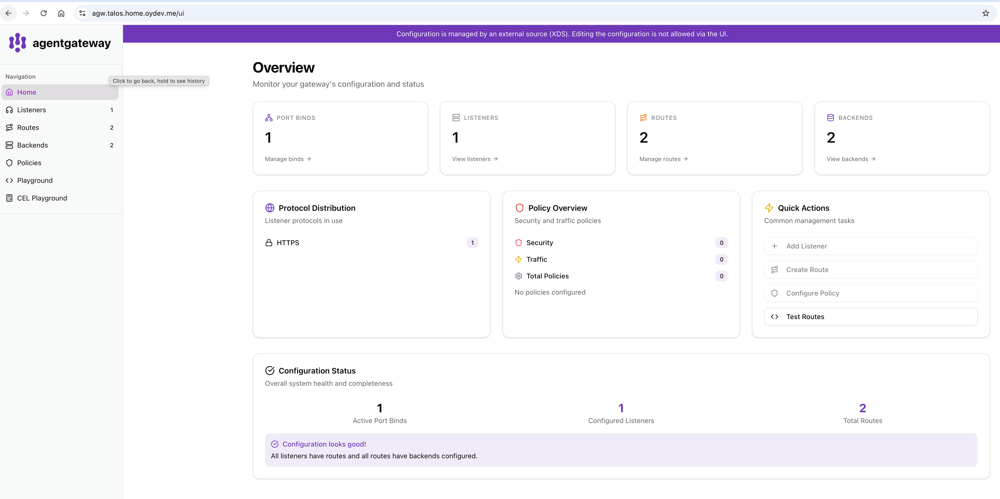
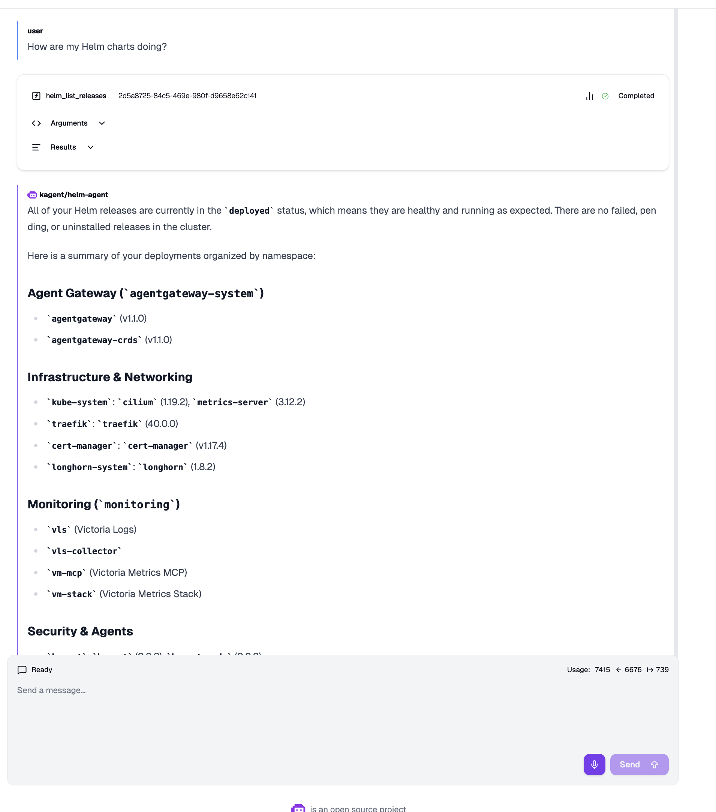
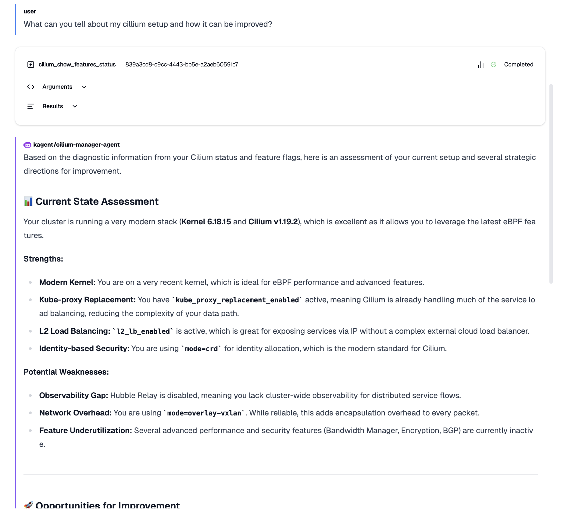

# Lab-1: Розгортання Basic Agentic Infrastructure

## Початківці

### 1. Встановити agentgateway локально https://agentgateway.dev/docs/standalone/latest/deployment/binary/

`config.yaml`
```yaml
llm:
  port: 4000
  models:
  - name: "gemma4:e4b-it-q8_0"
    provider: openAI
    params:
      hostOverride: "localhost:11434"
  - name: "qwen3.5:9b-q8_0"
    provider: openAI
    params:
      hostOverride: "localhost:11434"
binds:
- port: 3000
  listeners:
  - routes:
    - policies:
        cors:
          allowOrigins:
          - "*"
          allowHeaders:
          - mcp-protocol-version
          - content-type
          - cache-control
          exposeHeaders:
          - "Mcp-Session-Id"
      backends:
      - mcp:
          targets:
          - name: everything
            stdio:
              cmd: npx
              args: ["@modelcontextprotocol/server-everything"]
```
> Я одразу пішов по книжці *AI-Agents-in-Kubernetes-1stEdition-2025_10.pdf* одразу деплоїв як хельм чарт через флюкс [(секція Досвідчені.1)](#1-виконати-завдання-початківців-але-як-helm-deployment-в-kubernetes-кластері) тому наступні приклади будуть через CRD 


### 2. Обрати llm провайдера https://agentgateway.dev/docs/standalone/latest/llm/providers/
> Так як на даний момент є доступ до пк з 4090 обрав Ollama де запускаю Gemma4:26b або Qwen3.5:30b. В даному конфігу заекспоузив обмежений набір шляхів, щоб запобігти керування оллама моделями через апі, вказавши лише необхідні шляхи для використання існуючий моделей

```yaml
apiVersion: gateway.networking.k8s.io/v1
kind: HTTPRoute
metadata:
  name: ollama
  namespace: kagent
spec:
  parentRefs:
    - name: ai-gateway
      namespace: agentgateway-system
      sectionName: https
  hostnames:
    - ollama.talos-aw.home.oydev.me
  rules:
    - matches:
        - path:
            type: Exact
            value: /
        - path:
            type: PathPrefix
            value: /v1/
        - path:
            type: Exact
            value: /api/generate
        - path:
            type: Exact
            value: /api/chat
        - path:
            type: Exact
            value: /api/embed
        - path:
            type: Exact
            value: /api/embeddings
        - path:
            type: Exact
            value: /api/tags
        - path:
            type: Exact
            value: /api/ps
        - path:
            type: Exact
            value: /api/show
        - path:
            type: Exact
            value: /api/version
      backendRefs:
        - name: ollama-external
          port: 11434
```

### 3. Налаштувати config.yaml https://agentgateway.dev/docs/standalone/latest/tutorials/llm-gateway/

> Конфігурую через AgentgatewayParameters, в даному випадку вішаю IP-шник з пула *CiliumLoadBalancerIPPool*

`parameters.yaml`

```yaml
apiVersion: agentgateway.dev/v1alpha1
kind: AgentgatewayParameters
metadata:
  creationTimestamp: "2026-05-07T14:26:45Z"
  generation: 2
  labels:
    kustomize.toolkit.fluxcd.io/name: infra-configs
    kustomize.toolkit.fluxcd.io/namespace: flux-system
  name: lb-pin-91
  namespace: agentgateway-system
  resourceVersion: "2430242"
  uid: 931512a8-f467-4ea4-991d-4737812613a5
spec:
  rawConfig:
    config:
      adminAddr: 0.0.0.0:15000
  service:
    metadata:
      annotations:
        lbipam.cilium.io/ips: 192.168.88.91
```

### 4. Запустити gateway та отримати доступ через UI http://localhost:15000/ui/

> В минулій секції в `rawConfig.config.adminAddr`. Заекспоузав UI за допомогою Ingress-а, бо вже за дизайном на кластері усі веб-морди, я прокидую через Traefik, а AI-релейтед вже через Agentgateway.

```yaml
---
apiVersion: v1
kind: Service
metadata:
  name: ai-gateway-admin
  namespace: agentgateway-system
spec:
  type: ClusterIP
  selector:
    app.kubernetes.io/instance: ai-gateway
    app.kubernetes.io/name: ai-gateway
    gateway.networking.k8s.io/gateway-name: ai-gateway
  ports:
    - name: ui
      port: 15000
      protocol: TCP
      targetPort: 15000
---
apiVersion: networking.k8s.io/v1
kind: Ingress
metadata:
  name: agentgateway-ui
  namespace: agentgateway-system
  annotations:
    cert-manager.io/cluster-issuer: letsencrypt-production
spec:
  ingressClassName: traefik
  tls:
    - hosts:
        - agw.talos.home.oydev.me
      secretName: agentgateway-ui-tls
  rules:
    - host: agw.talos.home.oydev.me
      http:
        paths:
          - path: /
            pathType: Prefix
            backend:
              service:
                name: ai-gateway-admin
                port:
                  number: 15000
```



### 5. Перевірити доступ до llm та ознайомитися з фундаментальними можливостями Backends та Policy

```bash
curl https://ollama.talos-aw.home.oydev.me/v1/chat/completions \
  -H "Content-Type: application/json" \
  -d '{
    "model": "gemma4:26b",
    "messages": [{"role": "user", "content": "Hello!"}]
}'
```

```json
{
  "id": "chatcmpl-165",
  "object": "chat.completion",
  "created": 1778495482,
  "model": "gemma4:26b",
  "system_fingerprint": "fp_ollama",
  "choices": [
    {
      "index": 0,
      "message": {
        "role": "assistant",
        "content": "Hello! How can I help you today?",
        "reasoning": "The user said \"Hello!\".\nThis is a greeting.\nRespond with a friendly greeting and offer assistance.\n\nPlan:\n1. Greet the user back.\n2. Ask how I can help them today."
      },
      "finish_reason": "stop"
    }
  ],
  "usage": {
    "prompt_tokens": 18,
    "completion_tokens": 59,
    "total_tokens": 77
  }
}
```

`mcp-federation/backend.yaml` та httproute в секції [](#1-виконати-завдання-досвідчених-але-з-gateway-api-httpsagentgatewaydevdocskubernetesmainaboutgateway-api)

```yaml
---
apiVersion: agentgateway.dev/v1alpha1
kind: AgentgatewayBackend
metadata:
  name: mcp-federation
  namespace: monitoring
spec:
  mcp:
    sessionRouting: Stateful
    failureMode: FailOpen
    targets:
      - name: vm
        static:
          host: vm-mcp.monitoring.svc.cluster.local
          port: 8080
          path: /mcp
          protocol: StreamableHTTP
      - name: vlogs
        static:
          host: vlogs-mcp.monitoring.svc.cluster.local
          port: 8080
          path: /mcp
          protocol: StreamableHTTP
      - name: grafana
        static:
          host: kagent-grafana-mcp.kagent.svc.cluster.local
          port: 8000
          path: /mcp
          protocol: StreamableHTTP

```

## Досвідчені

### 1. Виконати завдання початківців але як helm deployment в Kubernetes кластері

```yaml
apiVersion: helm.toolkit.fluxcd.io/v2
kind: HelmRelease
metadata:
  name: agentgateway
  namespace: agentgateway-system
spec:
  interval: 1h
  timeout: 10m
  dependsOn:
    - name: agentgateway-crds
  chart:
    spec:
      chart: agentgateway
      version: "v1.1.0"
      sourceRef:
        kind: HelmRepository
        name: agentgateway
        namespace: flux-system
      interval: 12h
  install:
    remediation:
      retries: 3
  upgrade:
    remediation:
      retries: 3
  values:
    # -- Control plane only --
    # The chart deploys solely the agentgateway controller. Per-Gateway
    # data-plane proxies (Deployment + LoadBalancer Service) are spawned
    # by the controller when a `Gateway` resource referencing
    # `gatewayClassName: agentgateway` is created.
    controller:
      replicaCount: 1
      logLevel: info
      service:
        type: ClusterIP
      resources:
        requests:
          cpu: 50m
          memory: 128Mi
        limits:
          memory: 256Mi
```

### 2. Налаштувати Secrets та ConfigMap для API ключів та конфігурації

> Так як Ollama локальна, то ключі до неї не потрібні, якщо просто продемонструвати використання Secret для апіключів використовую Sealed Secrets контролер. На кластері розгорнутий cert-manager з letsencrypt-ом, і для челенджу треба доступ до апі днс провайдера(в моєму випадку це Cloudflare)

```bash
kubeseal --cert sealed-secrets-keys/cert.pem --format yaml \
  < cloudflare-api-token.yaml > cloudflare-api-token-sealed.yaml
```

`cloudflare-api-token-sealed.yaml`

```yaml
---
apiVersion: bitnami.com/v1alpha1
kind: SealedSecret
metadata:
  name: cloudflare-api-token
  namespace: cert-manager
spec:
  encryptedData:
    api-token: <encrypted_token>
  template:
    metadata:
      name: cloudflare-api-token
      namespace: cert-manager
    type: Opaque
```

### 3. Розгорнути kagent https://kagent.dev/docs/kagent/getting-started/quickstart

`release-crd.yaml`

```yaml
apiVersion: helm.toolkit.fluxcd.io/v2
kind: HelmRelease
metadata:
  name: kagent-crds
  namespace: kagent
spec:
  interval: 1h
  timeout: 5m
  chart:
    spec:
      chart: kagent-crds
      version: "0.9.*"
      sourceRef:
        kind: HelmRepository
        name: kagent
        namespace: flux-system
      interval: 12h
  install:
    crds: CreateReplace
    remediation:
      retries: 3
  upgrade:
    crds: CreateReplace
    remediation:
      retries: 3
```

`release.yaml`

```yaml
apiVersion: helm.toolkit.fluxcd.io/v2
kind: HelmRelease
metadata:
  name: kagent
  namespace: kagent
spec:
  interval: 1h
  timeout: 10m
  dependsOn:
    - name: kagent-crds
  chart:
    spec:
      chart: kagent
      version: "0.9.*"
      sourceRef:
        kind: HelmRepository
        name: kagent
        namespace: flux-system
      interval: 12h
  install:
    remediation:
      retries: 3
  upgrade:
    remediation:
      retries: 3
  values:
    providers:
      default: ollama
      ollama:
        provider: Ollama
        model: "gemma4:26b"
        config:
          host: https://ollama.talos-aw.home.oydev.me
          options:
            num_ctx: "24000"

    # -- Disable bundled toolset that depends on a Postgres pgvector --
    # querydoc embeds OpenAI; I am not using OpenAI in this homelab.
    querydoc:
      enabled: false

    controller:
      replicas: 1
      loglevel: "info"
      resources:
        requests:
          cpu: 100m
          memory: 128Mi
        limits:
          memory: 512Mi

    # -- UI --
    ui:
      replicas: 1
      resources:
        requests:
          cpu: 50m
          memory: 128Mi
        limits:
          memory: 512Mi

    # -- Bundled tools (k8s, helm, etc.) --
    kagent-tools:
      enabled: true
      resources:
        requests:
          cpu: 50m
          memory: 128Mi
        limits:
          memory: 256Mi

    # -- KMCP (Model Context Protocol) controller --
    kmcp:
      enabled: true
```

### 4. Налаштувати маршрут моделі через agentgateway

> Налаштував в чарті дефолтну модель і додаткову

```yaml
  values:
    providers:
      default: ollama
      ollama:
        provider: Ollama
        model: "gemma4:26b"
        config:
          host: https://ollama.talos-aw.home.oydev.me
          options:
            num_ctx: "24000"
```

```yaml
apiVersion: kagent.dev/v1alpha2
kind: ModelConfig
metadata:
  name: qwen3-27b-model-config
  namespace: kagent
spec:
  model: qwen3.5:27b
  provider: Ollama
  ollama:
    host: https://ollama.talos-aw.home.oydev.me
    options:
      num_ctx: "32000"
```

### 5. Перевірити роботу будь-якого вбудованого агента





## Макс

### 1. Виконати завдання досвідчених але з gateway API https://agentgateway.dev/docs/kubernetes/main/about/gateway-api/

> Я в цілому одразу деплоїв agentgateway з gateway API, `gateway-api-crds.yaml` налаштування самого Gateway API і `gateway.yaml`

`gateway-api-crds.yaml`

```yaml
apiVersion: source.toolkit.fluxcd.io/v1
kind: GitRepository
metadata:
  name: gateway-api
  namespace: flux-system
spec:
  interval: 24h
  url: https://github.com/kubernetes-sigs/gateway-api
  ref:
    tag: v1.5.1
  ignore: |
    /*
    !/config/crd/standard
---
apiVersion: kustomize.toolkit.fluxcd.io/v1
kind: Kustomization
metadata:
  name: gateway-api-crds
  namespace: flux-system
spec:
  interval: 1h
  retryInterval: 1m
  timeout: 5m
  sourceRef:
    kind: GitRepository
    name: gateway-api
  path: ./config/crd/standard
  # Never auto-prune CRDs — removing the Kustomization should not
  # cascade-delete cluster-wide types and their data.
  prune: false
  wait: true
```

`gateway.yaml`

```yaml
---
apiVersion: gateway.networking.k8s.io/v1
kind: Gateway
metadata:
  name: ai-gateway
  namespace: agentgateway-system
  annotations:
    cert-manager.io/cluster-issuer: letsencrypt-production
spec:
  gatewayClassName: agentgateway
  infrastructure:
    parametersRef:
      group: agentgateway.dev
      kind: AgentgatewayParameters
      name: lb-pin-91
  listeners:
    - name: https
      port: 443
      protocol: HTTPS
      hostname: "*.talos-aw.home.oydev.me"
      tls:
        mode: Terminate
        certificateRefs:
          - name: ai-gateway-tls
      allowedRoutes:
        namespaces:
          from: Selector
          selector:
            matchExpressions:
              - key: kubernetes.io/metadata.name
                operator: In
                values:
                  - monitoring
                  - kagent
```

`mcp-federatior.yaml/httproute.yaml`

```yaml
apiVersion: gateway.networking.k8s.io/v1
kind: HTTPRoute
metadata:
  name: mcp-federation
  namespace: monitoring
spec:
  parentRefs:
    - name: ai-gateway
      namespace: agentgateway-system
      sectionName: https
  hostnames:
    - mcp.talos-aw.home.oydev.me
  rules:
    - backendRefs:
        - group: agentgateway.dev
          kind: AgentgatewayBackend
          name: mcp-federation
```

## Research-1: Дати оцінку ADR проекту S&T: DevOps Bot/Agent

1. Ваші питання до проекту, запропонуйте покращення та рішення

> TBD
