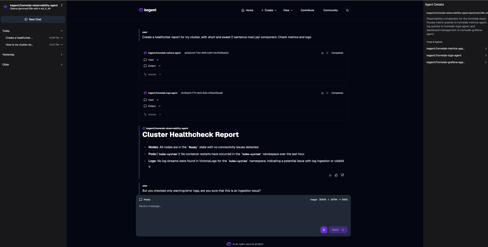

# Lab-2: Agentic Dashboard, MCP та GitOps-агенти

## Початківці

### 1. Розгорнути abox

> Робив на власній інфрі (Talos Linux K8s + Vanilla Flux)

### 2. Отримати UI доступи до Flux, Kagent та agentgateway

> Із-за того, що ванільний Flux, то без UI. Kagent та Agentgateway UI були розгорнуті і заекспоужені ще в [Lab1](../Lab1/LAB.md/)

### 3. Підключити модель, створити declarative MCP tool server та агента в Kagent

> Одразу деплоїв усе через GitOps, переробив стандартного observability-agent під свій стек VictoriaMetrics/Logs, спорядивши MCP [victoriametrics-mcp](vm-mcp-remoteserver.yaml) та .
Зіштовхнувся з проблемою, що при використання в межах того самого агента одночасно victoriametrics-mcp та victorialogs-mcp, виникав конфлікт, тому що обидва mcp мали тул з схожою назвою query. Вирішив проблему тим, що створив 3 окремі сабагенти

- [homelab-grafana-agent](./homelab-grafana-agent.md)
- [homelab-logs-agent](./homelab-logs-agent.md)
- [homelab-metrics-agent](./homelab-metrics-agent.md)

і обʼєднав їх в одному

- 

## Досвідчені

### 1. Розгортання MCP сервера та агента за допомогою GitOps

> Виконав в 

## Макс

### Development: 1. Завдання досвідчених але з власноруч розробленим MCP ( наприклад за допомогою KMCP) сервером та GitLessOps
