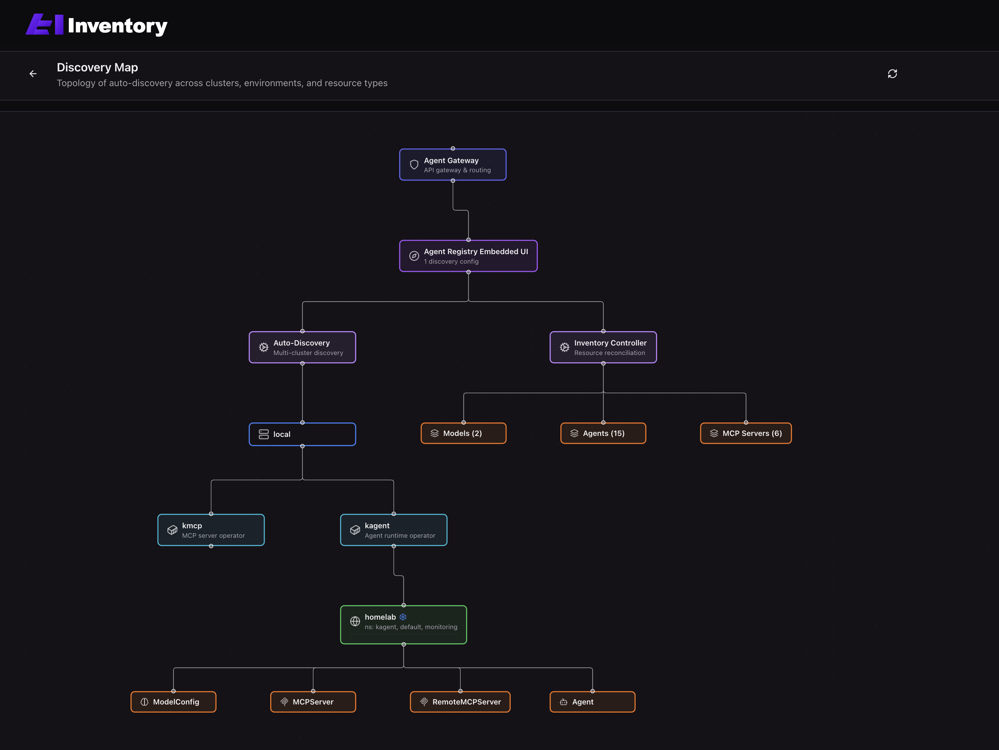
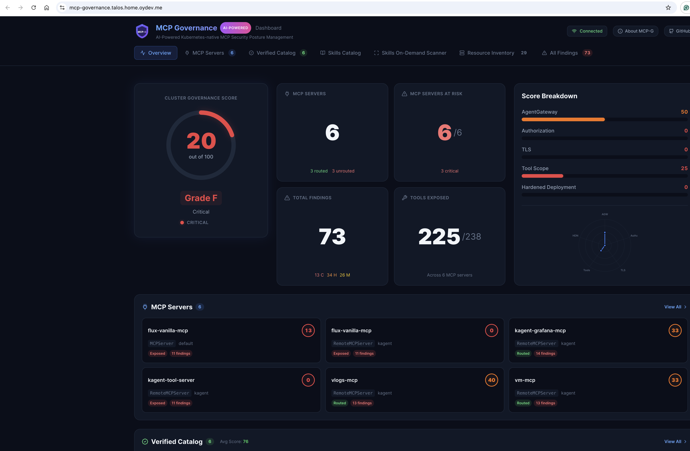
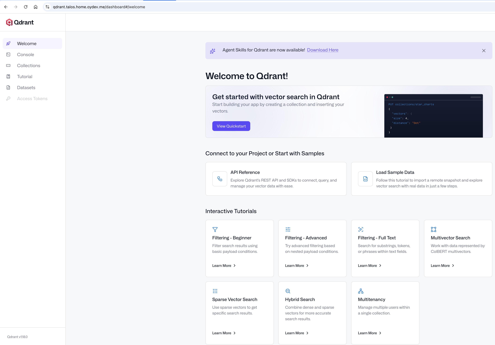

# Lab-4: A2A Protocol, Agent Cards та AI Inventory

## Початківці

### Development: 2. Реалізувати власного агента (будь який фреймворк) з Agent Card та отримати карту агента за Well-Known URI

> Візьму на прикладі агента, якого реалізував в [лабі 2](../Lab2/homelab-observability-agent.yaml), заекспоузав сервіс `kubectl port-forward -n kagent service/homelab-observability-agent 8080:8080` та на `http://localhost:8080/.well-known/agent.json` отримав 

```json
{
  "capabilities": {
    "pushNotifications": false,
    "stateTransitionHistory": true,
    "streaming": true
  },
  "defaultInputModes": [
    "text"
  ],
  "defaultOutputModes": [
    "text"
  ],
  "description": "Observability orchestrator for the homelab stack. Routes metric queries to homelab-metrics-agent, log queries to homelab-logs-agent, and dashboard management to homelab-grafana-agent.",
  "name": "homelab_observability_agent",
  "preferredTransport": "JSONRPC",
  "protocolVersion": "0.3.0",
  "skills": [
    {
      "description": "Generates and executes PromQL/MetricsQL queries against VictoriaMetrics, inspects series/labels/metadata, evaluates alert rules, and interprets the results.",
      "examples": [
        "Show me the 99th percentile latency for 'my-service' over the last hour.",
        "Run this MetricsQL — sum(rate(container_cpu_usage_seconds_total[5m])) by (pod) — and explain the result.",
        "Which alert rules are currently firing, and which series triggered them?",
        "What are the highest-cardinality metrics on the cluster right now?"
      ],
      "id": "victoriametrics-querying",
      "name": "VictoriaMetrics Monitoring & Querying",
      "tags": [
        "victoriametrics",
        "promql",
        "metricsql",
        "monitoring",
        "metrics",
        "alerting",
        "query"
      ]
    },
    {
      "description": "Explores log data in VictoriaLogs using LogsQL — searches hits, computes statistics, lists streams/fields/values, and correlates log activity with incidents.",
      "examples": [
        "Find error-level logs from the 'checkout-service' over the last 30 minutes.",
        "List all log streams in the 'monitoring' namespace and their hit counts.",
        "What distinct values does the 'level' field take in the last hour?",
        "Plot a 5-minute rate of HTTP 5xx responses from the ingress logs."
      ],
      "id": "victorialogs-querying",
      "name": "VictoriaLogs Querying",
      "tags": [
        "victorialogs",
        "logsql",
        "logs",
        "search",
        "debugging"
      ]
    },
    {
      "description": "Manages Grafana dashboards — searches, retrieves, creates, updates, and version-controls dashboards, plus inspects datasources and alert rules.",
      "examples": [
        "Find all Grafana dashboards related to 'nginx'.",
        "Show me the panel queries on the 'Kubernetes Overview' dashboard.",
        "List the datasources configured in Grafana.",
        "Which alert rules are configured for the 'api' folder?"
      ],
      "id": "grafana-dashboard-management",
      "name": "Grafana Dashboard Management",
      "tags": [
        "grafana",
        "dashboard",
        "visualization",
        "datasource",
        "alerting"
      ]
    },
    {
      "description": "Correlates Kubernetes resource state with VictoriaMetrics metrics and VictoriaLogs logs to investigate performance issues, pod restarts, and service degradations.",
      "examples": [
        "The 'checkout-service' pods are restarting — correlate the events with metrics and logs.",
        "Show resource utilization for nodes labeled 'workload=critical' alongside their recent events.",
        "Which workloads in 'prod' have the highest log-error rate right now?"
      ],
      "id": "kubernetes-observability-insights",
      "name": "Kubernetes Observability Insights",
      "tags": [
        "kubernetes",
        "observability",
        "troubleshooting",
        "performance",
        "correlation"
      ]
    }
  ],
  "url": "http://homelab-observability-agent.kagent:8080",
  "version": ""
}
```

### Infrastructure: 3. Розгорнути Inventory на abox (або будь-яку альтернативу) та отримати перелік AI ресурсів в кластері

```bash
kubectl apply -f ~/Projects/Learning/fwdays_ai_reliability/agentregistry-inventory/charts/agentregistry/discoveryconfig-homelab.yaml
helm install agentregistry ./charts/agentregistry \
  --namespace agentregistry \
  --values ./charts/agentregistry/values-homelab.yaml \
  --skip-crds
```

`values-homelab.yaml`

```yaml
replicaCount: 1

image:
  repository: ghcr.io/den-vasyliev/agentregistry-inventory
  pullPolicy: IfNotPresent
  tag: ""

controller:
  leaderElection: false
  logLevel: info

httpApi:
  port: 8080
  mcpPort: 8083
  serviceType: ClusterIP

disableAuth: true

resources:
  requests:
    cpu: 10m
    memory: 128Mi
  limits:
    cpu: 500m
    memory: 256Mi

httpRoute:
  enabled: true
  hostname: agentregistry.talos-aw.home.oydev.me
  gatewayName: ai-gateway
  gatewayNamespace: agentgateway-system
  sectionName: https

mcpRoute:
  enabled: false

```

> Так як по дефолтну воно не скрейпає, додав `DiscoveryConfig`

`discovery.yaml`

```yaml
---
apiVersion: agentregistry.dev/v1alpha1
kind: DiscoveryConfig
metadata:
  name: homelab
  namespace: agentregistry
spec:
  environments:
    - name: homelab
      cluster:
        name: local
      discoveryEnabled: true
      namespaces:
        - kagent
        - default
        - monitoring
      resourceTypes:
        - Agent
        - RemoteMCPServer
        - MCPServer
        - ModelConfig
      labels:
        environment: homelab
        cluster: talos-proxmox
```



### Infrastructure: 4. Розгорнути MCPG у власній AI Інфраструктурі (або аналогічний інструмент)

`values.yaml`

```yaml
createNamespace: false

controller:
  replicas: 1
  image:
    repository: ghcr.io/techwithhuz/mcp-governance-controller
    tag: "0.22.2"
    pullPolicy: IfNotPresent
  port: 8090
  service:
    type: ClusterIP
    nodePort: null
  resources:
    requests:
      cpu: 50m
      memory: 64Mi
    limits:
      cpu: 200m
      memory: 256Mi
  googleApiKeySecret: ""
  serviceAccount:
    create: true
    name: mcp-governance-controller

dashboard:
  enabled: true
  replicas: 1
  image:
    repository: ghcr.io/techwithhuz/mcp-governance-dashboard
    tag: "0.22.2"
    pullPolicy: IfNotPresent
  port: 3000
  resources:
    requests:
      cpu: 50m
      memory: 64Mi
    limits:
      cpu: 200m
      memory: 256Mi
  service:
    type: ClusterIP
    nodePort: null
  apiUrl: ""

crds:
  installExternal: false

samples:
  install: true

governancePolicy:
  name: homelab-mcp-policy
  spec:
    requireAgentGateway: true
    requireJWTAuth: false
    requireRBAC: true
    requireCORS: false
    requireTLS: true
    requirePromptGuard: false
    requireRateLimit: false
    maxToolsWarning: 10
    maxToolsCritical: 15
    targetNamespaces: []
    excludeNamespaces:
      - kube-system
      - kube-public
      - kube-node-lease
      - flux-system
      - longhorn-system
      - cert-manager
      - sealed-secrets
      - traefik
    aiAgent:
      enabled: false
      provider: ollama
      model: "qwen3.6:27b-q4_K_M"
      ollamaEndpoint: "https://ollama.talos-aw.home.oydev.me"
      scanInterval: "10m"
      scanEnabled: false
    verifiedCatalogScoring:
      securityWeight: 50
      trustWeight: 30
      complianceWeight: 20
      verifiedThreshold: 70
      unverifiedThreshold: 50
    skillGovernance:
      enabled: true
      scanRepoContent: true
      scanCacheTTLMinutes: 60
      failOnPromptInjection: true
      failOnPrivilegeEscalation: true
```

`ingress.yaml`

```yaml
---
apiVersion: networking.k8s.io/v1
kind: Ingress
metadata:
  name: mcp-governance-dashboard
  namespace: mcp-governance
  annotations:
    cert-manager.io/cluster-issuer: letsencrypt-production
spec:
  ingressClassName: traefik
  tls:
    - hosts:
        - mcp-governance.talos.home.oydev.me
      secretName: mcp-governance-dashboard-tls
  rules:
    - host: mcp-governance.talos.home.oydev.me
      http:
        paths:
          - path: /
            pathType: Prefix
            backend:
              service:
                name: mcp-governance-dashboard
                port:
                  number: 3000
```



### Infrastructure: 5. Розгорнути в abox векторну базу даних qdrant https://github.com/qdrant/qdrant-helm

> Тут робив GitOps-ом

```yaml
apiVersion: helm.toolkit.fluxcd.io/v2
kind: HelmRelease
metadata:
  name: qdrant
  namespace: qdrant
spec:
  interval: 1h
  timeout: 10m
  chart:
    spec:
      chart: qdrant
      version: "1.18.*"
      sourceRef:
        kind: HelmRepository
        name: qdrant
        namespace: flux-system
      interval: 12h
  install:
    remediation:
      retries: 3
  upgrade:
    remediation:
      retries: 3
  values:
    replicaCount: 1

    image:
      useUnprivilegedImage: true

    env:
      - name: QDRANT__SERVICE__API_KEY
        valueFrom:
          secretKeyRef:
            name: qdrant-api-key
            key: api-key

    persistence:
      size: 30Gi
      accessModes: ["ReadWriteOnce"]

    resources:
      requests:
        cpu: 250m
        memory: 1Gi
      limits:
        cpu: "2"
        memory: 2Gi

    config:
      cluster:
        enabled: false
      service:
        enable_tls: false

    livenessProbe:
      enabled: true
      initialDelaySeconds: 30
      periodSeconds: 10
      failureThreshold: 6

    startupProbe:
      enabled: true
      initialDelaySeconds: 10
      periodSeconds: 5
      failureThreshold: 30

    containerSecurityContext:
      runAsNonRoot: true
      runAsUser: 1000
      runAsGroup: 2000
      allowPrivilegeEscalation: false
      privileged: false
      readOnlyRootFilesystem: true
      capabilities:
        drop: ["ALL"]
      seccompProfile:
        type: RuntimeDefault

    podSecurityContext:
      fsGroup: 3000
      fsGroupChangePolicy: Always
      seccompProfile:
        type: RuntimeDefault

    service:
      type: ClusterIP

    ingress:
      enabled: true
      ingressClassName: traefik
      annotations:
        cert-manager.io/cluster-issuer: letsencrypt-production
      hosts:
        - host: qdrant.talos.home.oydev.me
          paths:
            - path: /
              pathType: Prefix
              servicePort: 6333
      tls:
        - hosts:
            - qdrant.talos.home.oydev.me
          secretName: qdrant-tls
```



## Досвідчені

### Development: 1. Реалізувати a2a task комунікацію між двома агентами

> Так само було реалізовано в [лабі 2](../Lab2/homelab-observability-agent.yaml)

## Макс

### Development: 1. Реалізувати a2a team з власним агентом та агентами kagent і поставити одне завдання на виконання різними агентами комплексно
